# AsignaturasSistemas
Rosa Estriégana  
Sunday, February 22, 2015  

# Análisis de notas del primer cuatrimestre del grado G58 Sistemas de información del curso 2009-10 al 2013-14

Realizado por Rosa Estriégana Valdehita

### Análisis convocatoria enero y junio en conjunto No presentados = 1
Se han realizado otros análisis por separado enero y junio y con No Presentados = 0 sin apenas variación.
En el caso de eliminar los No Presentados si existe diferencia pues en el primer año antes de entrar el Plan Bolonia, el nº de No presentados era más elevado por lo que si no se tienen en cuenta la media sube.)

### Introducción

> Se ha comprobado que en la asignatura 780002 Ftos. de Tecnología de Computadores en el año 13-14 en el que se han empledo videos docentes y tecnicas de aprendizaje activo se ha producido una mejora en los resultados académicos. El objetivo de este análisis es comprobar si en los resultados obtenidos en el resto de asignaturas del primer cuatrimestre durante los cursos 2009-2010, 2010-2011, 2011-2012, 2012-2013 y 2013-2014 en el grado Sistemas de Información en el primer cuatrimestre  ha habido una mejora en el resto de asignaturas o no. Se trata de valorar si la mejora en la asignatura de Fundamentos de Tecnología de Computadores en el año 13-14 realmente se debe al cambio en la metodologia docente y no a otras circunstancias como que el nivel de los alumnos sea superior al de otros años. 

> El fichero contiene las notas de las convocatorias de enero y junio de las asignaturas del primer cuatrimestre del grado G58  
780001                 Fundamentos Matemáticos                                                     
780002                 Fundamentos de Tecnología de Computadores               
780003                 Fundamentos de Programación                                              
780004                 Estadística                                                                                         
580001                 Gestión de Personas y Equipos                                               

### Librerías

```r
library(ggplot2)
library(grid)
library(gridExtra)
require(gridExtra)
```

### Obtención de los datos

```r
setwd("C:/Analisis Ftos")
notas<-read.csv("Datos/todas_asignaturas/NotasG58_1C_0910a1314.csv")
```


### Preparación de los datos
> Eliminar columnas no relevantes
> Eliminar espacios en blanco en la variable CALIFIC
> Añadir una columna en la que asignaremos los valores numéricos correspondientes a las notas.  
Equivalente numérico de la escala 0-10 ponderada: 
SUSPENSO = 2.5
APROBADO = 5.5 
NOTABLE = 7.5 
SOBRESALIENTE = 9.0 
MATRÍCULA DE HONOR = 10 
NO PRESENTADO = 1.0 
> En el caso de "NO PRESENTADO" es difícil asignar un valor numérico, pero se ha considerado que sí debe ser tenido en cuenta y que es el caso menos deseado. Vamos a asignarle un valor de 1. 

> Añadimos también la columna TOTAL que es el nº de alumnos que sacan una calificación (CALIFIC) por el valor de dicha calificación


```r
notas<-as.data.frame(notas[, c(1,2,5:7,10)])

notas$CALIFIC<-as.character(notas$CALIFIC)
notas$CALIFIC<-(gsub(" ","",notas$CALIFIC))

convierteNUM <- function(d){
       
    for (i in 1:length(d$CALIFIC)) {
      d$CALIFIC[i]<-as.character(d$CALIFIC[i])
      
      
      if(d$CALIFIC[i] == "Aprobado") d$CALIFIC.NUM[i]<- 5.5
      else if(d$CALIFIC[i] == "Matríc.Honor")d$CALIFIC.NUM[i]<- 10
      else if(d$CALIFIC[i] == "NoPresentado")d$CALIFIC.NUM[i]<- 1
      else if(d$CALIFIC[i] == "Notable")d$CALIFIC.NUM[i]<- 7.5
      else if(d$CALIFIC[i] == "Sobresaliente")d$CALIFIC.NUM[i]<- 9
      else d$CALIFIC.NUM[i]<- 2.5
     
    }
    return(d$CALIFIC.NUM) 
}

notas$CALIFIC.NUM <- convierteNUM(d<-as.data.frame(notas))

notas$TOTAL<- notas$CALIFIC.NUM
for (i in 1:length(notas$CALIFIC)) {
     notas$TOTAL[i] <- notas$CALIFIC.NUM[i] * notas$TOTAL.CALIF[i]
     }
```


## ANALISIS 1: MEDIA DE NOTAS DE LAS ASIGNATURAS DEL PRIMER CUATRIMESTRE DEL GRADO SISTEMAS DE INFORMACIÓN EN LOS DIFERENTES AÑOS 


```r
notas1<-as.data.frame(notas)
```

### Cálculos
Calculamos el total de alumnos por año y calculamos la media numérica de notas por Año 

```r
Total_alum_sis<-aggregate(TOTAL.CALIF ~  AÑO + ASIG, notas1, sum)
Total_Nota_sis<-aggregate(TOTAL ~  AÑO + ASIG, notas1, sum)
Total_Nota_sis$NAlumnos <- Total_alum_sis$TOTAL.CALIF

for (i in 1:length(Total_Nota_sis$TOTAL)) {
  Total_Nota_sis$Media[i] <- Total_Nota_sis$TOTAL[i] / Total_Nota_sis$NAlumnos[i]
  }
Total_Nota_sis
```

```
##        AÑO   ASIG TOTAL NAlumnos    Media
## 1  2009-10 580001 445.5       91 4.895604
## 2  2010-11 580001 476.5      124 3.842742
## 3  2011-12 580001 426.0      122 3.491803
## 4  2012-13 580001 541.5      129 4.197674
## 5  2013-14 580001 467.0       99 4.717172
## 6  2009-10 780001 254.0      119 2.134454
## 7  2010-11 780001 429.0      167 2.568862
## 8  2011-12 780001 378.5      172 2.200581
## 9  2012-13 780001 575.0      187 3.074866
## 10 2013-14 780001 449.5      132 3.405303
## 11 2009-10 780002 279.0       95 2.936842
## 12 2010-11 780002 422.0      134 3.149254
## 13 2011-12 780002 401.5      131 3.064885
## 14 2012-13 780002 447.5      146 3.065068
## 15 2013-14 780002 450.5      108 4.171296
## 16 2009-10 780003 200.0      102 1.960784
## 17 2010-11 780003 322.0      137 2.350365
## 18 2011-12 780003 346.5      128 2.707031
## 19 2012-13 780003 353.0      164 2.152439
## 20 2013-14 780003 460.5      176 2.616477
## 21 2009-10 780004 368.0      117 3.145299
## 22 2010-11 780004 525.0      174 3.017241
## 23 2011-12 780004 482.0      135 3.570370
## 24 2012-13 780004 451.5      140 3.225000
## 25 2013-14 780004 371.5      103 3.606796
```


### Calificaciones por asignatura
> 1. Agrupamos por asignatura
 

```r
s<-split(Total_Nota_sis, Total_Nota_sis$ASIG == "580001")
notas580001<-s$'TRUE'

s<-split(Total_Nota_sis, Total_Nota_sis$ASIG == "780001")
notas780001<-s$'TRUE'

s<-split(Total_Nota_sis, Total_Nota_sis$ASIG == "780002")
notas780002<-s$'TRUE'

s<-split(Total_Nota_sis, Total_Nota_sis$ASIG == "780003")
notas780003<-s$'TRUE'

s<-split(Total_Nota_sis, Total_Nota_sis$ASIG == "780004")
notas780004<-s$'TRUE'
```


### Gráficas

```r
dibuja <- function(d, title){
       qplot(AÑO, data = d, weight = Media, 
geom = "bar", binwidth = 1) + 
theme(axis.text.x = element_text(angle = 45, hjust = 1)) +                                                                                  ggtitle(title) +
xlab("Años") + ylab("Media de notas")
}

notas580001Plot <- dibuja(d<-as.data.frame(notas580001), "Gestión Personas y equipos")
notas780001Plot <- dibuja(d<-as.data.frame(notas780001), "Ftos. Matemáticos")
notas780002Plot <- dibuja(d<-as.data.frame(notas780002), "Ftos. Téc. Computadores")
notas780003Plot <- dibuja(d<-as.data.frame(notas780003), "Ftos. Programación")
notas780004Plot <- dibuja(d<-as.data.frame(notas780004), "Estadística")

grid.arrange(notas580001Plot, notas780001Plot, notas780002Plot, notas780003Plot, notas780004Plot,
 as.table=FALSE, main="Media de calificaciones por asignatura, con No Presentado=1", ncol = 2)
```

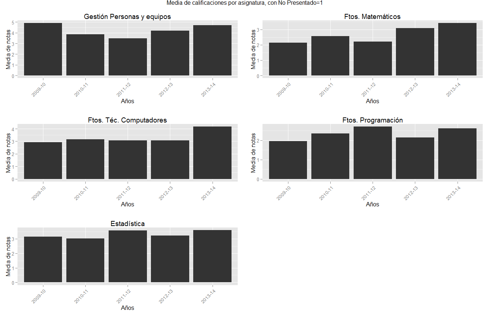 


### OBSERVACIONES Y CONCLUSIONES

Se observa que el año 13-14, fue un buen año en cuanto a resultados para todas las asignaturas. Se ha a tener en cuenta que en el curso 13-14 se creó un grupo de docencia retrasada para los alumnos que se incorporan tras la selectividad de septiembre entre los que hay bastantes alumnos del grado G58 "Sistemas de Información."

A diferencia de otros años, en los que había un goteo de alumnos que se incorporaban 3, 4 e incluso 5 semanas después del comienzo de las clases con el resto de alumnos, este grupo de docencia retrasada comienza 5 semanas después del comienzo de las clases dedicando mayor nº de horas a la semana para alcanzar el mismo número de horas de docencia que los otros grupos. 

A pesar de todo lo observado,la mejora en la media de notas en dicho curso, comparando con el resto de años, es claramente más acusada en la asignatura bajo estudio, Fundamentos de Técnología de computadores, que en el resto.

Se ha comparado solo con asignaturas del primer cuatrimestre ya que al ser una asignatura de primero es cuando más abandonos de carrera hay y también previsiblemente los alumnos sacan peores notas por estar menos habituados al salto cualitativo que supone los estudios superiores, sinembargo en el año 2009-10 la asignatura Gestión de Personas y Equipos se impartió en el 2º cuatrimestre, quizás por ello los resultados son significativamente mejores que otros años.

También se ha de tener en cuenta que en el caso de la asignatura de Ftos. de Técnología de Computadores el docente ha sido el mismo en todos los años, razón por la que se eligio este Grado de Sistemas de Información, sinembargo se desconoce si en el resto de asignaturas los profesores han sido diferentes en los diferentes años.  


## ANÁLISIS 2: PORCENTAJE DE NOTAS DE LAS ASIGNATURAS DEL PRIMER CUATRIMESTRE DEL GRADO SISTEMAS DE INFORMACIÓN EN LOS DIFERENTES AÑOS (Convocatoria de Enero)

En este análisis se tiene en cuenta solo la  convocatoria de Enero.

En el análisis 1 no se ha tenido en cuenta que el nº de alumnos es diferente en los distintos años y en las diferentes asignaturas, por lo que la media, que ha servido para un primer análisis, no es un buen indicativo. Ahora veremos las notas en porcentaje para cada una de las asignaturas.

También se ha realizado un análisis comparativo en todas las asignaturas del porcentaje de alumnos que ha superado la asignatura en cada uno de los años (aprobados + notables + sob. + Matrícula) (gráficas en color)


```r
notas2<-as.data.frame(notas)
```

### Convocatoria de Enero


```r
s<-split(notas2, notas2$CONVOCATORIA == "ENE")
notasEnero<-s$'TRUE'
notasJunio<-s$'FALSE'
```

### Calificaciones por asignatura
 

```r
#Agrupamos por asignatura

s<-split(notasEnero, notasEnero$ASIG == "580001")
nota580001<-s$'TRUE'

s<-split(notasEnero, notasEnero$ASIG == "780001")
nota780001<-s$'TRUE'

s<-split(notasEnero, notasEnero$ASIG == "780002")
nota780002<-s$'TRUE'

s<-split(notasEnero, notasEnero$ASIG == "780003")
nota780003<-s$'TRUE'

s<-split(notasEnero, notasEnero$ASIG == "780004")
nota780004<-s$'TRUE'
```
  
## Bucle para cálculos  y gráficas por asignatura
  

```r
for(j in 1:5){
  if(j==1){
    notaAsignatura<-nota580001
    title<-"Gestión de personas y equipos"
    fich<-"580001Enero.png"
  }
  else if(j==2){
    notaAsignatura<-nota780001
    title<-"Fundamentos Matemáticos"
    fich<-"780001Enero.png"
  }
  
  else if(j==3){
    notaAsignatura<-nota780002
    title<-"Fundamentos de Tecnología de Computadores"
    fich<-"780002Enero.png"
  }
  
  else if(j==4){
    notaAsignatura<-nota780003
    title<-"Fundamentos de Programación"
    fich<-"780003Enero.png"
  }
  
  else{
    notaAsignatura<-nota780004
    title<-"Estadística"
    fich<-"780004Enero.png"
  }
  
# Cálculos y gráficas

s<-split(notaAsignatura, notaAsignatura$AÑO == "2009-10")
notas0910<-s$'TRUE'

s<-split(notaAsignatura, notaAsignatura$AÑO == "2010-11")
notas1011<-s$'TRUE'

s<-split(notaAsignatura, notaAsignatura$AÑO == "2011-12")
notas1112<-s$'TRUE'

s<-split(notaAsignatura, notaAsignatura$AÑO == "2012-13")
notas1213<-s$'TRUE'

s<-split(notaAsignatura, notaAsignatura$AÑO == "2013-14")
notas1314<-s$'TRUE'

#Calculamos los porcentajes de calificaciones por año

calculaPorcentaje <- function(d){
  
  for (i in 1:length(d$TOTAL))
  d$Porcentaje[i] <- d$TOTAL.CALIF[i] * 100 / sum(d$TOTAL.CALIF)
  return(d$Porcentaje) 
  }
notas0910$Porcentaje <- calculaPorcentaje(d<-as.data.frame(notas0910))
notas1011$Porcentaje <- calculaPorcentaje(d<-as.data.frame(notas1011))
notas1112$Porcentaje <- calculaPorcentaje(d<-as.data.frame(notas1112))
notas1213$Porcentaje <- calculaPorcentaje(d<-as.data.frame(notas1213))
notas1314$Porcentaje <- calculaPorcentaje(d<-as.data.frame(notas1314))

n0910porcent<-as.data.frame(notas0910[, c(1,5,9)])
n1011porcent<-as.data.frame(notas1011[, c(1,5,9)])
n1112porcent<-as.data.frame(notas1112[, c(1,5,9)])
n1213porcent<-as.data.frame(notas1213[, c(1,5,9)])
n1314porcent<-as.data.frame(notas1314[, c(1,5,9)])


# Gráficas

dibuja <- function(d, title){
       qplot(CALIFIC, data = d, weight = Porcentaje, 
geom = "bar", binwidth = 1) + 
theme(axis.text.x = element_text(angle = 45, hjust = 1)) +                                                                                  ggtitle(title) +
xlab("Calificaciones") + ylab("Porcentajes")
}

notas0910Plot <- dibuja(d<-as.data.frame(notas0910), "CALIFICACIONES 09-10")
notas1011Plot <- dibuja(d<-as.data.frame(notas1011), "CALIFICACIONES 10-11")
notas1112Plot <- dibuja(d<-as.data.frame(notas1112), "CALIFICACIONES 11-12")
notas1213Plot <- dibuja(d<-as.data.frame(notas1213), "CALIFICACIONES 12-13")
notas1314Plot <- dibuja(d<-as.data.frame(notas1314), "CALIFICACIONES 13-14")

grid.arrange(notas0910Plot, notas1011Plot, notas1112Plot, notas1213Plot, notas1314Plot,
 as.table=FALSE, main=title, ncol = 2)

# Gráficas a fichero.png
png(file=fich)
grid.arrange(notas0910Plot, notas1011Plot, notas1112Plot, notas1213Plot, notas1314Plot,
 as.table=FALSE, main=title, ncol = 2)
dev.off()

print(title)
print(n0910porcent)
print(n1011porcent)
print(n1112porcent)
print(n1213porcent)
print(n1314porcent)

# SUMA en PORCENTAJE DE APROBADOS (Convocatoria de Enero) #


cursos<-c()
aprueban<-c()
for(i in 1:5){
  if(i==1){
    Apr<-n0910porcent
    Año<-"Curso 09-10"
        
  }
  else if(i==2){
    Apr<-n1011porcent
    Año<-"Curso 10-11"
  }
  
  else if(i==3){
    Apr<-n1112porcent
    Año<-"Curso 11-12"
  }
  
  else if(i==4){
    Apr<-n1213porcent
    Año<-"Curso 12-13"
  }
    
  else {
    Apr<-n1314porcent
    Año<-"Curso 13-14"
  }

s<-split(Apr, Apr$CALIFIC != "NoPresentado" & Apr$CALIFIC != "Suspenso")
y<-s$'TRUE'

aprueban[i]<-sum(y$Porcentaje)
cursos[i]<-Año

}
if(j==1) {asignatura1<-data.frame(cursos,aprueban)}
else if(j==2) {asignatura2<-data.frame(cursos,aprueban)}
else if(j==3) {asignatura3<-data.frame(cursos,aprueban)}
else if(j==4) {asignatura4<-data.frame(cursos,aprueban)}
else  {asignatura5<-data.frame(cursos,aprueban)}

}
```

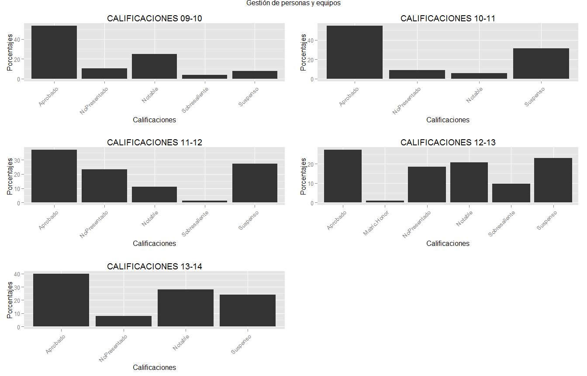 

```
## [1] "Gestión de personas y equipos"
##         AÑO       CALIFIC Porcentaje
## 174 2009-10      Aprobado  53.246753
## 175 2009-10  NoPresentado  10.389610
## 176 2009-10       Notable  24.675325
## 177 2009-10 Sobresaliente   3.896104
## 178 2009-10      Suspenso   7.792208
##         AÑO      CALIFIC Porcentaje
## 179 2010-11     Aprobado  54.444444
## 180 2010-11 NoPresentado   8.888889
## 181 2010-11      Notable   5.555556
## 182 2010-11     Suspenso  31.111111
##         AÑO       CALIFIC Porcentaje
## 187 2011-12      Aprobado  37.037037
## 188 2011-12  NoPresentado  23.456790
## 189 2011-12       Notable  11.111111
## 190 2011-12 Sobresaliente   1.234568
## 191 2011-12      Suspenso  27.160494
##         AÑO       CALIFIC Porcentaje
## 196 2012-13      Aprobado  27.173913
## 197 2012-13  Matríc.Honor   1.086957
## 198 2012-13  NoPresentado  18.478261
## 199 2012-13       Notable  20.652174
## 200 2012-13 Sobresaliente   9.782609
## 201 2012-13      Suspenso  22.826087
##         AÑO      CALIFIC Porcentaje
## 206 2013-14     Aprobado         40
## 207 2013-14 NoPresentado          8
## 208 2013-14      Notable         28
## 209 2013-14     Suspenso         24
```

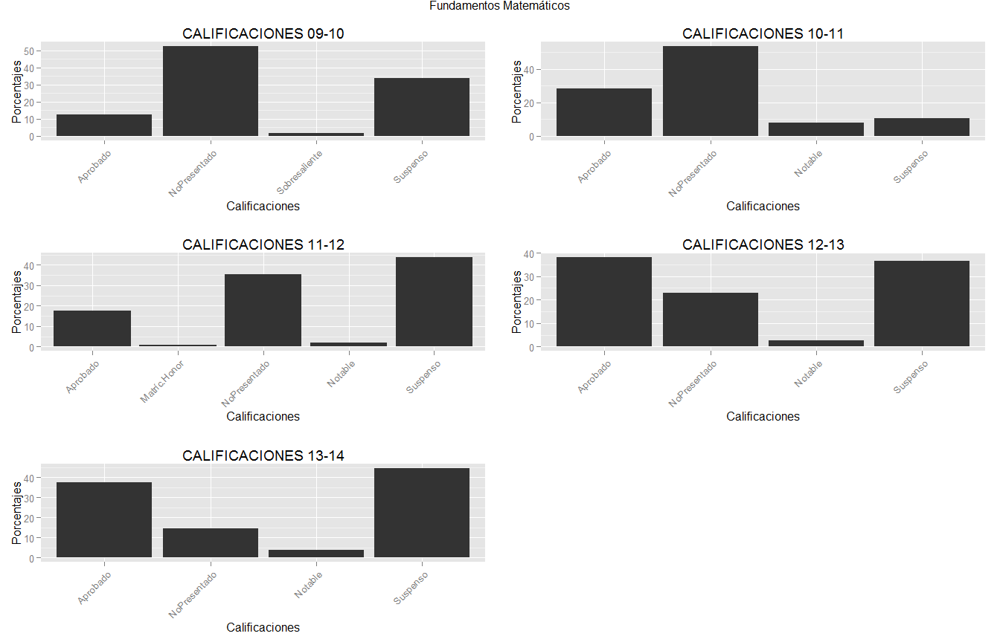 

```
## [1] "Fundamentos Matemáticos"
##       AÑO       CALIFIC Porcentaje
## 1 2009-10      Aprobado  12.307692
## 2 2009-10  NoPresentado  52.307692
## 3 2009-10 Sobresaliente   1.538462
## 4 2009-10      Suspenso  33.846154
##        AÑO      CALIFIC Porcentaje
## 9  2010-11     Aprobado   28.15534
## 10 2010-11 NoPresentado   53.39806
## 11 2010-11      Notable    7.76699
## 12 2010-11     Suspenso   10.67961
##        AÑO      CALIFIC Porcentaje
## 17 2011-12     Aprobado  17.708333
## 18 2011-12 Matríc.Honor   1.041667
## 19 2011-12 NoPresentado  35.416667
## 20 2011-12      Notable   2.083333
## 21 2011-12     Suspenso  43.750000
##        AÑO      CALIFIC Porcentaje
## 25 2012-13     Aprobado  38.135593
## 26 2012-13 NoPresentado  22.881356
## 27 2012-13      Notable   2.542373
## 28 2012-13     Suspenso  36.440678
##        AÑO      CALIFIC Porcentaje
## 33 2013-14     Aprobado  37.349398
## 34 2013-14 NoPresentado  14.457831
## 35 2013-14      Notable   3.614458
## 36 2013-14     Suspenso  44.578313
```

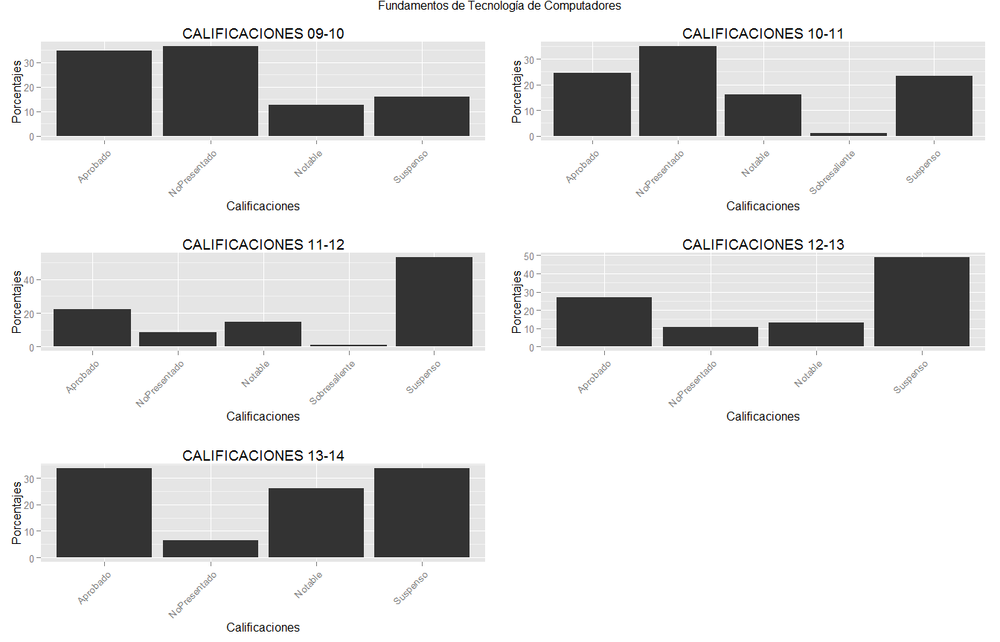 

```
## [1] "Fundamentos de Tecnología de Computadores"
##        AÑO      CALIFIC Porcentaje
## 41 2009-10     Aprobado   34.92063
## 42 2009-10 NoPresentado   36.50794
## 43 2009-10      Notable   12.69841
## 44 2009-10     Suspenso   15.87302
##        AÑO       CALIFIC Porcentaje
## 48 2010-11      Aprobado  24.418605
## 49 2010-11  NoPresentado  34.883721
## 50 2010-11       Notable  16.279070
## 51 2010-11 Sobresaliente   1.162791
## 52 2010-11      Suspenso  23.255814
##        AÑO       CALIFIC Porcentaje
## 57 2011-12      Aprobado  22.222222
## 58 2011-12  NoPresentado   8.641975
## 59 2011-12       Notable  14.814815
## 60 2011-12 Sobresaliente   1.234568
## 61 2011-12      Suspenso  53.086420
##        AÑO      CALIFIC Porcentaje
## 65 2012-13     Aprobado   27.17391
## 66 2012-13 NoPresentado   10.86957
## 67 2012-13      Notable   13.04348
## 68 2012-13     Suspenso   48.91304
##        AÑO      CALIFIC Porcentaje
## 73 2013-14     Aprobado  33.766234
## 74 2013-14 NoPresentado   6.493506
## 75 2013-14      Notable  25.974026
## 76 2013-14     Suspenso  33.766234
```

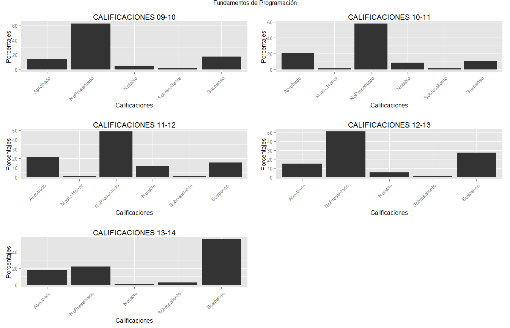 

```
## [1] "Fundamentos de Programación"
##        AÑO       CALIFIC Porcentaje
## 81 2009-10      Aprobado  13.793103
## 82 2009-10  NoPresentado  62.068966
## 83 2009-10       Notable   5.172414
## 84 2009-10 Sobresaliente   1.724138
## 85 2009-10      Suspenso  17.241379
##        AÑO       CALIFIC Porcentaje
## 89 2010-11      Aprobado  20.481928
## 90 2010-11  Matríc.Honor   1.204819
## 91 2010-11  NoPresentado  57.831325
## 92 2010-11       Notable   8.433735
## 93 2010-11 Sobresaliente   1.204819
## 94 2010-11      Suspenso  10.843373
##         AÑO       CALIFIC Porcentaje
## 99  2011-12      Aprobado  21.794872
## 100 2011-12  Matríc.Honor   1.282051
## 101 2011-12  NoPresentado  48.717949
## 102 2011-12       Notable  11.538462
## 103 2011-12 Sobresaliente   1.282051
## 104 2011-12      Suspenso  15.384615
##         AÑO       CALIFIC Porcentaje
## 109 2012-13      Aprobado  15.217391
## 110 2012-13  NoPresentado  51.086957
## 111 2012-13       Notable   5.434783
## 112 2012-13 Sobresaliente   1.086957
## 113 2012-13      Suspenso  27.173913
##         AÑO       CALIFIC Porcentaje
## 117 2013-14      Aprobado  18.181818
## 118 2013-14  NoPresentado  22.222222
## 119 2013-14       Notable   1.010101
## 120 2013-14 Sobresaliente   3.030303
## 121 2013-14      Suspenso  55.555556
```

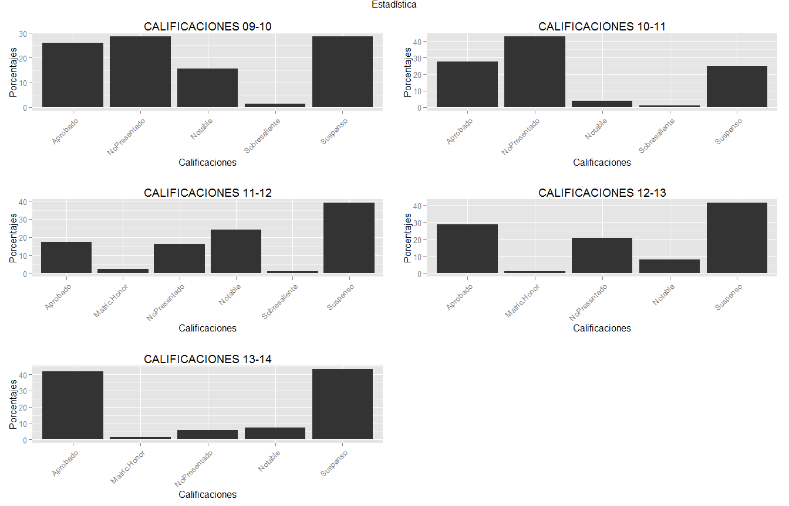 

```
## [1] "Estadística"
##         AÑO       CALIFIC Porcentaje
## 126 2009-10      Aprobado  25.974026
## 127 2009-10  NoPresentado  28.571429
## 128 2009-10       Notable  15.584416
## 129 2009-10 Sobresaliente   1.298701
## 130 2009-10      Suspenso  28.571429
##         AÑO       CALIFIC Porcentaje
## 134 2010-11      Aprobado  27.619048
## 135 2010-11  NoPresentado  42.857143
## 136 2010-11       Notable   3.809524
## 137 2010-11 Sobresaliente   0.952381
## 138 2010-11      Suspenso  24.761905
##         AÑO       CALIFIC Porcentaje
## 144 2011-12      Aprobado  17.241379
## 145 2011-12  Matríc.Honor   2.298851
## 146 2011-12  NoPresentado  16.091954
## 147 2011-12       Notable  24.137931
## 148 2011-12 Sobresaliente   1.149425
## 149 2011-12      Suspenso  39.080460
##         AÑO      CALIFIC Porcentaje
## 153 2012-13     Aprobado  28.735632
## 154 2012-13 Matríc.Honor   1.149425
## 155 2012-13 NoPresentado  20.689655
## 156 2012-13      Notable   8.045977
## 157 2012-13     Suspenso  41.379310
##         AÑO      CALIFIC Porcentaje
## 162 2013-14     Aprobado  42.028986
## 163 2013-14 Matríc.Honor   1.449275
## 164 2013-14 NoPresentado   5.797101
## 165 2013-14      Notable   7.246377
## 166 2013-14     Suspenso  43.478261
```

```r
dibujaAprobados <- function(d, title){
       qplot(cursos, data = d, weight = aprueban, 
geom = "bar", binwidth = 1, fill = cursos) + 
theme(axis.text.x = element_text(angle = 45, hjust = 1)) +                                                                                  ggtitle(title) +
xlab("Cursos") + ylab("Porcentaje de aprobados")
}

for(j in 1:5){
    if(j==1) {
      title<-"Gestión de personas y equipos"
      print(title)
      print(asignatura1)
      Plot1<-dibujaAprobados(d<-as.data.frame(asignatura1), title)
            
      }
    else if(j==2) {
      title<-"Fundamentos Matemáticos"
      print(title)
      print(asignatura2)
      Plot2<-dibujaAprobados(d<-as.data.frame(asignatura2), title)
      }
    else if(j==3) {
      title<-"Fundamentos de Tecnología de Computadores"
      print(title)
      print(asignatura3)
      Plot3<-dibujaAprobados(d<-as.data.frame(asignatura3), title)
      }
    else if(j==4) {
      title<-"Fundamentos de Programación"
      print(title)
      print(asignatura4)
      Plot4<-dibujaAprobados(d<-as.data.frame(asignatura4), title)
      }
    else  {
      title<-"Estadística"
      print(title)
      print(asignatura5)
      Plot5<-dibujaAprobados(d<-as.data.frame(asignatura5), title)
      }
    
}
```

```
## [1] "Gestión de personas y equipos"
##        cursos aprueban
## 1 Curso 09-10 81.81818
## 2 Curso 10-11 60.00000
## 3 Curso 11-12 49.38272
## 4 Curso 12-13 58.69565
## 5 Curso 13-14 68.00000
## [1] "Fundamentos Matemáticos"
##        cursos aprueban
## 1 Curso 09-10 13.84615
## 2 Curso 10-11 35.92233
## 3 Curso 11-12 20.83333
## 4 Curso 12-13 40.67797
## 5 Curso 13-14 40.96386
## [1] "Fundamentos de Tecnología de Computadores"
##        cursos aprueban
## 1 Curso 09-10 47.61905
## 2 Curso 10-11 41.86047
## 3 Curso 11-12 38.27160
## 4 Curso 12-13 40.21739
## 5 Curso 13-14 59.74026
## [1] "Fundamentos de Programación"
##        cursos aprueban
## 1 Curso 09-10 20.68966
## 2 Curso 10-11 31.32530
## 3 Curso 11-12 35.89744
## 4 Curso 12-13 21.73913
## 5 Curso 13-14 22.22222
## [1] "Estadística"
##        cursos aprueban
## 1 Curso 09-10 42.85714
## 2 Curso 10-11 32.38095
## 3 Curso 11-12 44.82759
## 4 Curso 12-13 37.93103
## 5 Curso 13-14 50.72464
```

```r
grid.arrange(Plot1, Plot2, Plot3, Plot4, Plot5,as.table=FALSE, main="Porcentaje de aprobados en Enero", ncol = 2)
```

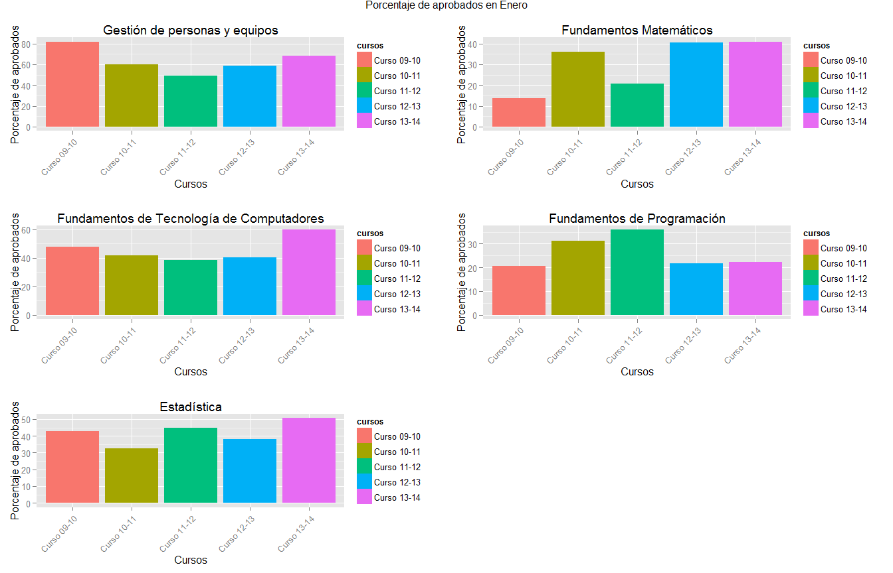 

```r
# Gráficas a fichero.png
png(file="aprobadosEnero.png")
grid.arrange(Plot1, Plot2, Plot3, Plot4, Plot5,as.table=FALSE, main="Porcentaje de aprobados en Enero", ncol = 2)
dev.off()
```

```
## png 
##   2
```


## ANÁLISIS 3: PORCENTAJE DE NOTAS DE LAS ASIGNATURAS DEL PRIMER CUATRIMESTRE DEL GRADO SISTEMAS DE INFORMACIÓN EN LOS DIFERENTES AÑOS (Convocatoria de Junio)

En este análisis se tiene en cuenta solo la  convocatoria de Junio.

Al igual que en el análisis 2  veremos las notas en porcentaje para cada una de las asignaturas pero ahora en la convocatoria de Junio.

También se ha realizado un análisis comparativo en todas las asignaturas del porcentaje de alumnos que ha superado la asignatura en cada uno de los años (aprobados + notables + sob. + Matrícula) (gráficas en color)


```r
notas2<-as.data.frame(notas)
```
### Convocatoria de Junio

```r
s<-split(notas2, notas2$CONVOCATORIA == "ENE")
notasEnero<-s$'TRUE'
notasJunio<-s$'FALSE'
```

### Calificaciones por asignatura


```r
#Agrupamos por asignatura

s<-split(notasJunio, notasJunio$ASIG == "580001")
nota580001<-s$'TRUE'

s<-split(notasJunio, notasJunio$ASIG == "780001")
nota780001<-s$'TRUE'

s<-split(notasJunio, notasJunio$ASIG == "780002")
nota780002<-s$'TRUE'

s<-split(notasJunio, notasJunio$ASIG == "780003")
nota780003<-s$'TRUE'

s<-split(notasJunio, notasJunio$ASIG == "780004")
nota780004<-s$'TRUE'
```


```r
# Bucle para cálculos y gráficas por asignatura

for(i in 1:5){
  if(i==1){
    notaAsignatura<-nota580001
    title<-"Gestión de personas y equipos junio"
    fich<-"580001junio.png"
  }
  else if(i==2){
    notaAsignatura<-nota780001
    title<-"Fundamentos Matemáticos junio"
    fich<-"780001junio.png"
  }
  
  else if(i==3){
    notaAsignatura<-nota780002
    title<-"Fundamentos de Tecnología de Computadores junio "
    fich<-"780002junio.png"
  }
  
  else if(i==4){
    notaAsignatura<-nota780003
    title<-"Fundamentos de Programación junio"
    fich<-"780003junio.png"
  }
  
  else{
    notaAsignatura<-nota780004
    title<-"Estadística junio"
    fich<-"780004junio.png"
  }
  
# Cálculos y gráficas

s<-split(notaAsignatura, notaAsignatura$AÑO == "2009-10")
notas0910<-s$'TRUE'

s<-split(notaAsignatura, notaAsignatura$AÑO == "2010-11")
notas1011<-s$'TRUE'

s<-split(notaAsignatura, notaAsignatura$AÑO == "2011-12")
notas1112<-s$'TRUE'

s<-split(notaAsignatura, notaAsignatura$AÑO == "2012-13")
notas1213<-s$'TRUE'

s<-split(notaAsignatura, notaAsignatura$AÑO == "2013-14")
notas1314<-s$'TRUE'

#Calculamos los porcentajes de calificaciones por año

calculaPorcentaje <- function(d){
  
  for (i in 1:length(d$TOTAL))
  d$Porcentaje[i] <- d$TOTAL.CALIF[i] * 100 / sum(d$TOTAL.CALIF)
  return(d$Porcentaje) 
  }
notas0910$Porcentaje <- calculaPorcentaje(d<-as.data.frame(notas0910))
notas1011$Porcentaje <- calculaPorcentaje(d<-as.data.frame(notas1011))
notas1112$Porcentaje <- calculaPorcentaje(d<-as.data.frame(notas1112))
notas1213$Porcentaje <- calculaPorcentaje(d<-as.data.frame(notas1213))
notas1314$Porcentaje <- calculaPorcentaje(d<-as.data.frame(notas1314))

n0910porcent<-as.data.frame(notas0910[, c(1,5,9)])
n1011porcent<-as.data.frame(notas1011[, c(1,5,9)])
n1112porcent<-as.data.frame(notas1112[, c(1,5,9)])
n1213porcent<-as.data.frame(notas1213[, c(1,5,9)])
n1314porcent<-as.data.frame(notas1314[, c(1,5,9)])


# Gráficas

dibuja <- function(d, title){
       qplot(CALIFIC, data = d, weight = Porcentaje, 
geom = "bar", binwidth = 1) + 
theme(axis.text.x = element_text(angle = 45, hjust = 1)) +                                                                                  ggtitle(title) +
xlab("Calificaciones") + ylab("Porcentajes")
}

notas0910Plot <- dibuja(d<-as.data.frame(notas0910), "CALIFICACIONES 09-10")
notas1011Plot <- dibuja(d<-as.data.frame(notas1011), "CALIFICACIONES 10-11")
notas1112Plot <- dibuja(d<-as.data.frame(notas1112), "CALIFICACIONES 11-12")
notas1213Plot <- dibuja(d<-as.data.frame(notas1213), "CALIFICACIONES 12-13")
notas1314Plot <- dibuja(d<-as.data.frame(notas1314), "CALIFICACIONES 13-14")

grid.arrange(notas0910Plot, notas1011Plot, notas1112Plot, notas1213Plot, notas1314Plot,
 as.table=FALSE, main=title, ncol = 2)

# Gráficas a fichero.png
png(file=fich)
grid.arrange(notas0910Plot, notas1011Plot, notas1112Plot, notas1213Plot, notas1314Plot,
 as.table=FALSE, main=title, ncol = 2)
dev.off()

print(title)
print(n0910porcent)
print(n1011porcent)
print(n1112porcent)
print(n1213porcent)
print(n1314porcent)

# SUMA en PORCENTAJE DE APROBADOS (Convocatoria de Junio) #


cursos<-c()
aprueban<-c()
for(i in 1:5){
  if(i==1){
    Apr<-n0910porcent
    Año<-"Curso 09-10"
        
  }
  else if(i==2){
    Apr<-n1011porcent
    Año<-"Curso 10-11"
  }
  
  else if(i==3){
    Apr<-n1112porcent
    Año<-"Curso 11-12"
  }
  
  else if(i==4){
    Apr<-n1213porcent
    Año<-"Curso 12-13"
  }
    
  else {
    Apr<-n1314porcent
    Año<-"Curso 13-14"
  }

s<-split(Apr, Apr$CALIFIC != "NoPresentado" & Apr$CALIFIC != "Suspenso")
y<-s$'TRUE'

aprueban[i]<-sum(y$Porcentaje)
cursos[i]<-Año

}
if(j==1) {asignatura1<-data.frame(cursos,aprueban)}
else if(j==2) {asignatura2<-data.frame(cursos,aprueban)}
else if(j==3) {asignatura3<-data.frame(cursos,aprueban)}
else if(j==4) {asignatura4<-data.frame(cursos,aprueban)}
else  {asignatura5<-data.frame(cursos,aprueban)}

}
```

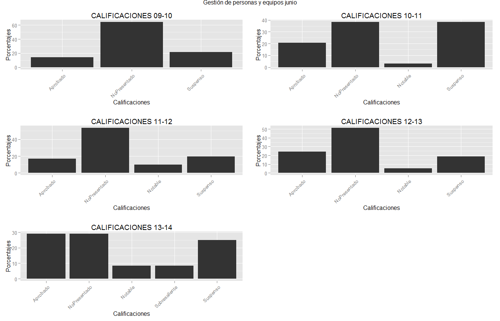 

```
## [1] "Gestión de personas y equipos junio"
##         AÑO      CALIFIC Porcentaje
## 171 2009-10     Aprobado   14.28571
## 172 2009-10 NoPresentado   64.28571
## 173 2009-10     Suspenso   21.42857
##         AÑO      CALIFIC Porcentaje
## 183 2010-11     Aprobado  20.588235
## 184 2010-11 NoPresentado  38.235294
## 185 2010-11      Notable   2.941176
## 186 2010-11     Suspenso  38.235294
##         AÑO      CALIFIC Porcentaje
## 192 2011-12     Aprobado  17.073171
## 193 2011-12 NoPresentado  53.658537
## 194 2011-12      Notable   9.756098
## 195 2011-12     Suspenso  19.512195
##         AÑO      CALIFIC Porcentaje
## 202 2012-13     Aprobado  24.324324
## 203 2012-13 NoPresentado  51.351351
## 204 2012-13      Notable   5.405405
## 205 2012-13     Suspenso  18.918919
##         AÑO       CALIFIC Porcentaje
## 210 2013-14      Aprobado  29.166667
## 211 2013-14  NoPresentado  29.166667
## 212 2013-14       Notable   8.333333
## 213 2013-14 Sobresaliente   8.333333
## 214 2013-14      Suspenso  25.000000
```

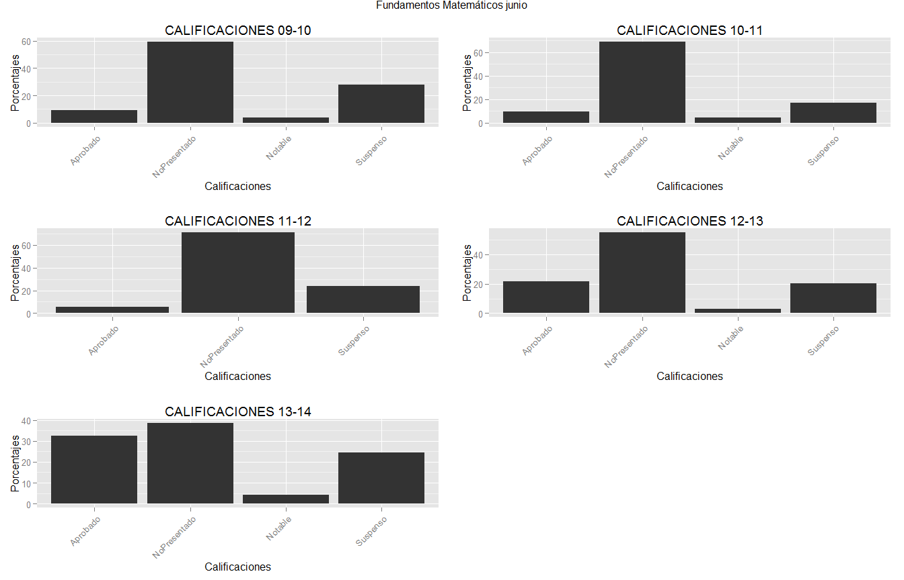 

```
## [1] "Fundamentos Matemáticos junio"
##       AÑO      CALIFIC Porcentaje
## 5 2009-10     Aprobado   9.259259
## 6 2009-10 NoPresentado  59.259259
## 7 2009-10      Notable   3.703704
## 8 2009-10     Suspenso  27.777778
##        AÑO      CALIFIC Porcentaje
## 13 2010-11     Aprobado     9.3750
## 14 2010-11 NoPresentado    68.7500
## 15 2010-11      Notable     4.6875
## 16 2010-11     Suspenso    17.1875
##        AÑO      CALIFIC Porcentaje
## 22 2011-12     Aprobado   5.263158
## 23 2011-12 NoPresentado  71.052632
## 24 2011-12     Suspenso  23.684211
##        AÑO      CALIFIC Porcentaje
## 29 2012-13     Aprobado  21.739130
## 30 2012-13 NoPresentado  55.072464
## 31 2012-13      Notable   2.898551
## 32 2012-13     Suspenso  20.289855
##        AÑO      CALIFIC Porcentaje
## 37 2013-14     Aprobado  32.653061
## 38 2013-14 NoPresentado  38.775510
## 39 2013-14      Notable   4.081633
## 40 2013-14     Suspenso  24.489796
```

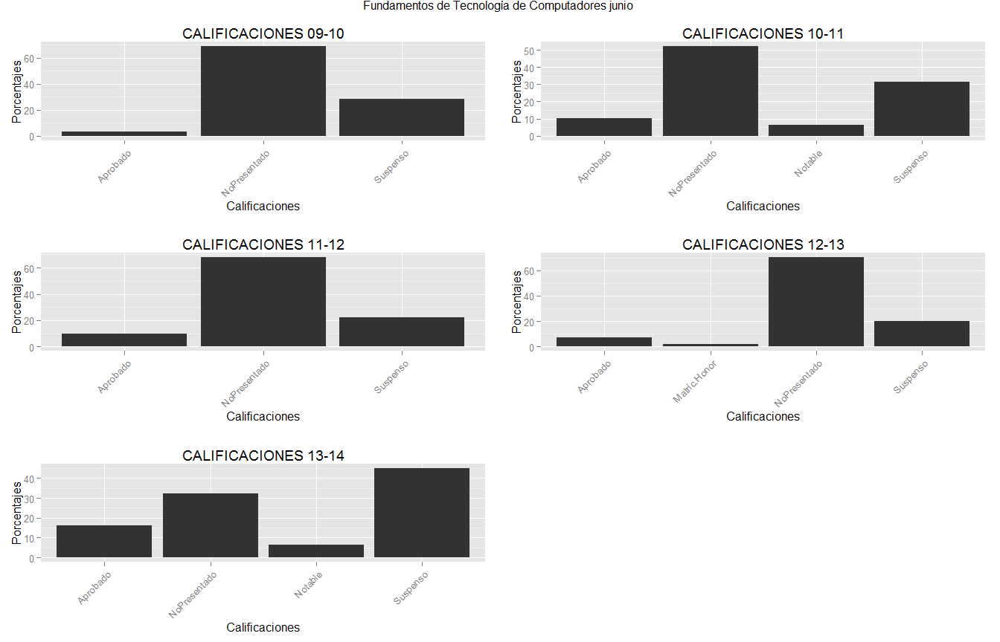 

```
## [1] "Fundamentos de Tecnología de Computadores junio "
##        AÑO      CALIFIC Porcentaje
## 45 2009-10     Aprobado      3.125
## 46 2009-10 NoPresentado     68.750
## 47 2009-10     Suspenso     28.125
##        AÑO      CALIFIC Porcentaje
## 53 2010-11     Aprobado   10.41667
## 54 2010-11 NoPresentado   52.08333
## 55 2010-11      Notable    6.25000
## 56 2010-11     Suspenso   31.25000
##        AÑO      CALIFIC Porcentaje
## 62 2011-12     Aprobado         10
## 63 2011-12 NoPresentado         68
## 64 2011-12     Suspenso         22
##        AÑO      CALIFIC Porcentaje
## 69 2012-13     Aprobado   7.407407
## 70 2012-13 Matríc.Honor   1.851852
## 71 2012-13 NoPresentado  70.370370
## 72 2012-13     Suspenso  20.370370
##        AÑO      CALIFIC Porcentaje
## 77 2013-14     Aprobado  16.129032
## 78 2013-14 NoPresentado  32.258065
## 79 2013-14      Notable   6.451613
## 80 2013-14     Suspenso  45.161290
```

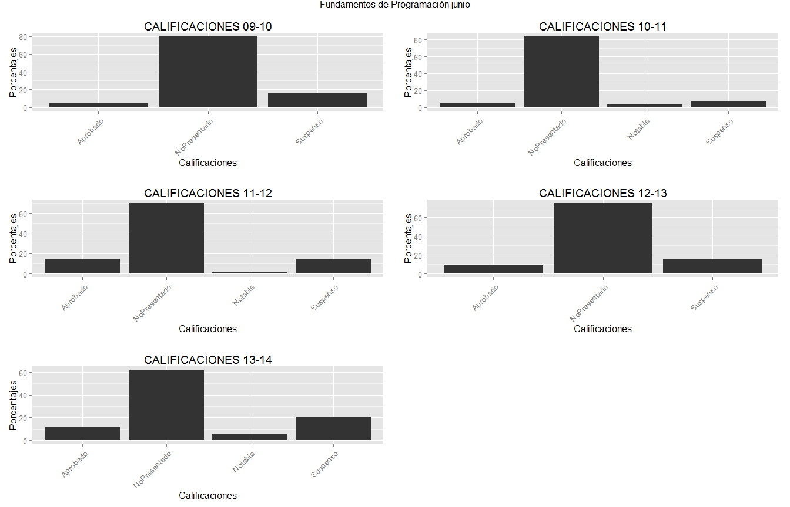 

```
## [1] "Fundamentos de Programación junio"
##        AÑO      CALIFIC Porcentaje
## 86 2009-10     Aprobado   4.545455
## 87 2009-10 NoPresentado  79.545455
## 88 2009-10     Suspenso  15.909091
##        AÑO      CALIFIC Porcentaje
## 95 2010-11     Aprobado   5.555556
## 96 2010-11 NoPresentado  83.333333
## 97 2010-11      Notable   3.703704
## 98 2010-11     Suspenso   7.407407
##         AÑO      CALIFIC Porcentaje
## 105 2011-12     Aprobado         14
## 106 2011-12 NoPresentado         70
## 107 2011-12      Notable          2
## 108 2011-12     Suspenso         14
##         AÑO      CALIFIC Porcentaje
## 114 2012-13     Aprobado   9.722222
## 115 2012-13 NoPresentado  75.000000
## 116 2012-13     Suspenso  15.277778
##         AÑO      CALIFIC Porcentaje
## 122 2013-14     Aprobado  11.688312
## 123 2013-14 NoPresentado  62.337662
## 124 2013-14      Notable   5.194805
## 125 2013-14     Suspenso  20.779221
```

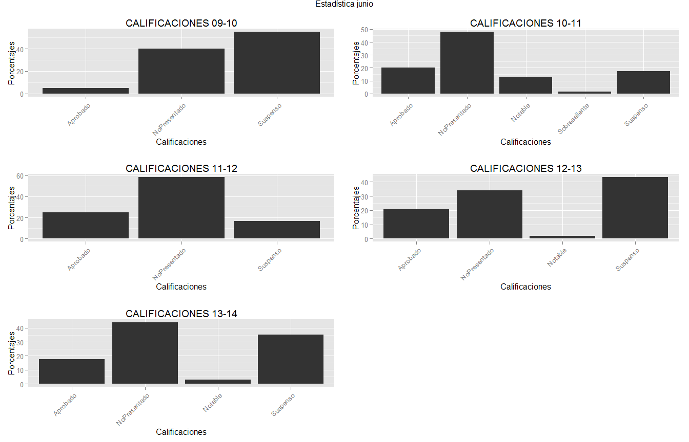 

```
## [1] "Estadística junio"
##         AÑO      CALIFIC Porcentaje
## 131 2009-10     Aprobado          5
## 132 2009-10 NoPresentado         40
## 133 2009-10     Suspenso         55
##         AÑO       CALIFIC Porcentaje
## 139 2010-11      Aprobado  20.289855
## 140 2010-11  NoPresentado  47.826087
## 141 2010-11       Notable  13.043478
## 142 2010-11 Sobresaliente   1.449275
## 143 2010-11      Suspenso  17.391304
##         AÑO      CALIFIC Porcentaje
## 150 2011-12     Aprobado   25.00000
## 151 2011-12 NoPresentado   58.33333
## 152 2011-12     Suspenso   16.66667
##         AÑO      CALIFIC Porcentaje
## 158 2012-13     Aprobado  20.754717
## 159 2012-13 NoPresentado  33.962264
## 160 2012-13      Notable   1.886792
## 161 2012-13     Suspenso  43.396226
##         AÑO      CALIFIC Porcentaje
## 167 2013-14     Aprobado  17.647059
## 168 2013-14 NoPresentado  44.117647
## 169 2013-14      Notable   2.941176
## 170 2013-14     Suspenso  35.294118
```

```r
dibujaAprobados <- function(d, title){
       qplot(cursos, data = d, weight = aprueban, 
geom = "bar", binwidth = 1, fill = cursos) + 
theme(axis.text.x = element_text(angle = 45, hjust = 1)) +                                                                                  ggtitle(title) +
xlab("Cursos") + ylab("Porcentaje de aprobados")
}

for(j in 1:5){
    if(j==1) {
      title<-"Gestión de personas y equipos"
      print(title)
      print(asignatura1)
      Plot1<-dibujaAprobados(d<-as.data.frame(asignatura1), title)
            
      }
    else if(j==2) {
      title<-"Fundamentos Matemáticos"
      print(title)
      print(asignatura2)
      Plot2<-dibujaAprobados(d<-as.data.frame(asignatura2), title)
      }
    else if(j==3) {
      title<-"Fundamentos de Tecnología de Computadores"
      print(title)
      print(asignatura3)
      Plot3<-dibujaAprobados(d<-as.data.frame(asignatura3), title)
      }
    else if(j==4) {
      title<-"Fundamentos de Programación"
      print(title)
      print(asignatura4)
      Plot4<-dibujaAprobados(d<-as.data.frame(asignatura4), title)
      }
    else  {
      title<-"Estadística"
      print(title)
      print(asignatura5)
      Plot5<-dibujaAprobados(d<-as.data.frame(asignatura5), title)
      }
    
}
```

```
## [1] "Gestión de personas y equipos"
##        cursos aprueban
## 1 Curso 09-10 81.81818
## 2 Curso 10-11 60.00000
## 3 Curso 11-12 49.38272
## 4 Curso 12-13 58.69565
## 5 Curso 13-14 68.00000
## [1] "Fundamentos Matemáticos"
##        cursos aprueban
## 1 Curso 09-10 13.84615
## 2 Curso 10-11 35.92233
## 3 Curso 11-12 20.83333
## 4 Curso 12-13 40.67797
## 5 Curso 13-14 40.96386
## [1] "Fundamentos de Tecnología de Computadores"
##        cursos aprueban
## 1 Curso 09-10 47.61905
## 2 Curso 10-11 41.86047
## 3 Curso 11-12 38.27160
## 4 Curso 12-13 40.21739
## 5 Curso 13-14 59.74026
## [1] "Fundamentos de Programación"
##        cursos aprueban
## 1 Curso 09-10 20.68966
## 2 Curso 10-11 31.32530
## 3 Curso 11-12 35.89744
## 4 Curso 12-13 21.73913
## 5 Curso 13-14 22.22222
## [1] "Estadística"
##        cursos aprueban
## 1 Curso 09-10  5.00000
## 2 Curso 10-11 34.78261
## 3 Curso 11-12 25.00000
## 4 Curso 12-13 22.64151
## 5 Curso 13-14 20.58824
```

```r
grid.arrange(Plot1, Plot2, Plot3, Plot4, Plot5,as.table=FALSE, main="Porcentaje de aprobados en Junio", ncol = 2)
```

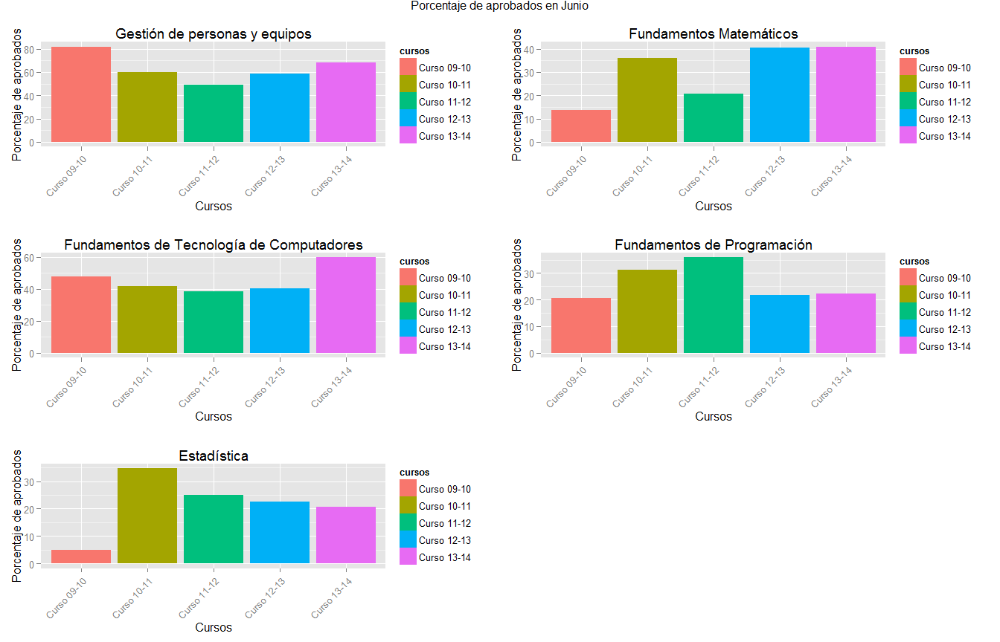 

```r
# Gráficas a fichero.png
png(file="aprobadosjunio.png")
grid.arrange(Plot1, Plot2, Plot3, Plot4, Plot5,as.table=FALSE, main="Porcentaje de aprobados en junio", ncol = 2)
dev.off()
```

```
## png 
##   2
```
### OBSERVACIONES Y CONCLUSIONES

En la asignatura bajo estudio, Fundamentos  de Tecnologia de Computadores se puede apreciar que el porcentaje de alumnos que superan la asignatura es más regular que en el resto de asignaturas, quizás debido a que ha sido la misma profesora quien ha impartido dicha asignatura mientras que se desconoce si en el resto de asignaturas el docente ha variado.

En la convocatoría de Enero se ve una mejora en el curso 13-14 en la asignatura de Estadística y también son buenos los resultados ese año en la asignatura de Ftos. Matemáticos (iguales que en el 12-13)
En el resto de asignaturas no existe mejora ese año.

Es aún más significativa la mejora en el porcentaje de aprobados en el año 13-14 en la asignatura de Fundamentos  de Tecnologia de Computadores

En la convocatoria de Junio se mantienen similares los resultados (igual que en el 12-13) en la asignatura de Ftos. Matemáticos, y no hay mejoría de resultados en el curso 13-14 para el resto de asignaturas exceptuando Fundamentos de Tecnología de Computadores donde de nuevo se ve una significativa mejora.


